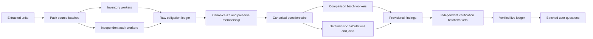

# Parallel review and live verification ledger

Status: accepted direction, implemented first increment on 2026-09-20. The implementation contract and remaining work are in [the parallel runtime LLD](lld/03-parallel-review.md). Detailed proposals below are not all shipped. The user rejected a single aggregate worker card; separate live worker threads are required.

## Why this work is necessary

The first large review exposed substantial latency in the serial pipeline. It was not a thorough correctness evaluation:

| Measurement                                | Observed result |
| ------------------------------------------ | --------------: |
| Elapsed before cancellation                |          6h 42m |
| Gemini calls                               |           1,078 |
| Accounted input tokens                     |       3,896,529 |
| Accounted output tokens                    |         324,202 |
| Source units inventoried and audited       |         44 / 44 |
| Inventory + independent audit time         |            ~47m |
| Raw reconciled obligations                 |           1,090 |
| Findings completed                         |             172 |
| Comparison calls for 173 started checks    |             816 |
| Average comparison calls per started check |            4.72 |

The pipeline preserves the union of reviewer and auditor output and removes only exact duplicates. That is safe against silent deletion, but it turns wording variants, repeated workbook sections, and the two independent passes into too many separate comparison tasks. Parallelizing all 1,090 items without canonicalization would reduce wall-clock time while retaining unnecessary calls, cost, duplicated findings, and rate-limit pressure.

## Recommended system shape

Use a deterministic PostgreSQL scheduler with bounded parallel model workers. Keep the workflow inside the modular monolith; a separate multi-agent framework is not required.



The application workflow owns dependencies, leases, retries, coverage, and merge rules. Models perform bounded semantic work. This is an orchestrator-worker pattern, but the orchestrator should be deterministic application code rather than another LLM.

## Preserve raw facts; present canonical checks

Introduce two levels instead of using one `Obligation` object for everything:

1. A **raw obligation** is an immutable fact extracted from one source location by one inventory pass. It retains its wording, document, unit, evidence IDs, and reviewer/auditor provenance.
2. A **canonical check** is the user-facing comparison axis. It groups raw obligations that concern the same subject, coverage, clause, amount, condition, entity, and period. Conflicting values remain separate raw variants inside the same check.

Every raw obligation must have a terminal disposition:

- member of one canonical check;
- exact duplicate alias of another raw obligation;
- out of scope with a reason;
- unresolved and visible for review.

Canonicalization may combine items for execution, but it cannot delete evidence. A coverage audit verifies that every raw ID is represented exactly once. Ambiguous candidates remain separate.

Suggested records:

```text
review_work_items
raw_obligations
raw_obligation_dispositions
canonical_checks
canonical_check_members
comparison_packets
check_findings
finding_verifications
review_events
```

`canonical_check_members` makes fan-in explainable: the UI can always show which policy and quotation facts produced a questionnaire item.

## Stage 1 — pack and inventory sources in parallel

### Packing

Increase spreadsheet batch size, but choose it through measurements rather than the model context limit alone. The failed 30-row placement-slip batch used only 2,531 input and 2,155 output tokens when replayed successfully. Gemini 3.8 Flash currently advertises a 1M-token context and 64k maximum output, so the provider envelope is much larger than this batch.

Start the evaluation with 30, 60, and 90 adjacent spreadsheet rows. Select the largest size that preserves row-disposition recall and stable structured output. A sensible first implementation candidate is 60 rows. If validation fails, split the batch in half and retry the halves instead of retrying the same oversized packet.

PDFs need structure-aware packing. Combine adjacent pages only when section headings and continuations indicate they belong together. A fixed row strategy does not transfer safely to policy pages.

### Parallel work

- Create one reviewer inventory work item and one independent-auditor work item for each packed source batch.
- Let both passes run concurrently with isolated input contexts.
- Start with four total Gemini request slots per project, make the value configurable, and adjust it from observed quota behavior.
- Commit each validated result independently. A failed worker cannot roll back completed siblings.
- Publish progress counters and work-item states over the existing SSE stream.

Questionnaire rows can appear as `discovered` while inventory completes. They remain visibly draft until the coverage and canonicalization barriers finish.

## Stage 2 — eliminate duplicate work without losing coverage

Run fan-in in layers:

1. Normalize whitespace, case, punctuation, currency formats, reference labels, and stable entity names.
2. Treat identical text as a grouping candidate only. Sheet identity, headings, entities, periods and nearby qualifications may change its meaning.
3. Generate candidate groups using category, entity, clause/reference, normalized title, amounts, dates, and lexical similarity.
4. Ask a constrained canonicalizer to assign each candidate raw ID to a canonical check. It may not omit an input ID.
5. Run deterministic membership validation. Unassigned or multiply assigned IDs fail the packet.
6. Keep uncertain groups separate and mark them for later review.

This stage should reduce the 1,090 raw obligations to the actual number of comparison questions. The reduction must be measured; no target count should be invented before inspecting results.

## Stage 3 — compare questionnaire batches

Replace the current autonomous loop per obligation with packet-oriented evidence resolution:

1. Select 8–12 related canonical checks from one category/entity group.
2. Resolve all known policy and quotation members and evidence in one deterministic database operation.
3. Perform batched search for unresolved references and exact identifiers.
4. Give one comparison worker the packet and require one result for every check ID.
5. If particular checks need more evidence, return typed evidence requests keyed to those checks.
6. Resolve all requests together and allow one focused follow-up packet. Checks still lacking evidence become `unverified`; they do not loop silently.

This converts roughly five model turns per check into one or two turns per packet. Inventory membership can identify missing candidates, but cannot prove documentary absence. The shipped version leaves these claims unverified; exhaustive absence investigation remains separate work.

Amounts, totals, percentages, dates, and quantities still use deterministic tools. A batch result cannot mark a numerical conclusion verified unless its referenced calculation result exists.

## Stage 4 — independently verify findings in batches

Verification stays independent from comparison, but it should process packets:

- Give a verifier 8–12 provisional findings plus only their original evidence, calculations, scope, and structural-check results.
- Require a verification result for every finding ID exactly once.
- Run multiple verifier packets concurrently.
- Route conflicts, absence findings, unresolved references, and high-impact amounts to a deeper verifier pass.
- Avoid repeating an expensive second semantic pass for a simple finding when deterministic equality and citation checks already establish the result; this optimization must be justified by evaluation.

The verifier never sees or edits another verifier's mutable context. Parallel workers write to disjoint finding IDs, so fan-in is a transactional state update rather than a conversation among agents.

## Durable work scheduling

Add leased work items with a unique key such as `(run_id, stage, partition_key, revision)`. States:

```text
blocked → ready → running → completed
                      ↘ retry_wait
                      ↘ failed
                      ↘ cancelled
```

Dependencies are stage-specific rather than a general-purpose workflow language:

- canonicalization waits for both inventory passes for its partition;
- final canonical coverage waits for every source partition;
- comparison waits for the final canonical checklist;
- verification for a packet can begin as soon as that comparison packet commits;
- user questions are emitted after all independent comparison and verification work reaches a terminal state.

Use `FOR UPDATE SKIP LOCKED`, lease heartbeats, idempotent unique keys, and checkpointed outputs. Begin with several asynchronous worker loops in the existing worker process. The same table design permits horizontal workers later.

## Gemini quotas and adaptive concurrency

Google currently applies limits per project rather than per API key. It evaluates requests per minute, input tokens per minute, requests per day, and sometimes a rolling spend limit. Exact model quotas vary by usage tier and project; Google directs users to **Google AI Studio → Dashboard → Rate Limits** for their actual numbers.

Do not hardcode an assumed public quota. Add provider controls:

```text
GEMINI_MAX_CONCURRENCY=4
GEMINI_RPM=<value copied from AI Studio, optional>
GEMINI_INPUT_TPM=<value copied from AI Studio, optional>
```

The request scheduler should:

- reserve concurrency and estimated input-token capacity before dispatch;
- use actual usage after completion;
- honor `429` and `Retry-After` when available;
- apply exponential backoff with jitter;
- reduce active concurrency after repeated 429s and increase it slowly after a stable interval;
- prioritize interactive scope/clarification calls over bulk review work;
- allocate fairly across concurrent reviews;
- expose throttled/retry states in the activity UI.

Gemini's Batch API is not the default for an interactive review. It costs less, but its documented completion objective is within 24 hours and it does not fit the live questionnaire experience. It may later support an explicit economy/offline mode.

Gemini 3.8 Flash defaults to medium thinking. Evaluate `low` for mechanical row inventory and deterministic candidate classification, while retaining medium for semantic comparison and independent verification. This changes latency and reasoning effort, not the native output-token limit, and must pass the same coverage evals before adoption.

## Live questionnaire and verification panel

Keep chat as the narrative and control surface. Add a shared review ledger as the primary inspection surface.

### Desktop

```text
┌────────────┬──────────────────────────────┬──────────────────────┐
│ Tasks/files│ Conversation + activity      │ Review ledger        │
│            │                              │ 172 / ? verified     │
│            │ milestone messages           │ filters + groups     │
│            │ parallel-stage summaries     │ live check rows      │
└────────────┴──────────────────────────────┴──────────────────────┘
```

The ledger is collapsible and resizable. A full-screen mode becomes the main workspace rather than a larger drawer.

### Ledger behavior

- Append draft questionnaire checks as canonical records commit.
- Update the same row through `discovered`, `ready`, `comparing`, `provisional`, `verifying`, and terminal states.
- Group by category with filters for pending, aligned, different, missing, unverified, needs input, and source limitations.
- Virtualize the list so hundreds of checks do not render at once.
- Show direction, worker state, evidence count, policy/quotation presence, verification state, and unresolved questions.
- Preserve a stable check URL so refresh/back navigation restores the same item.

Selecting a check opens a detail workspace with:

- canonical question and all raw source members;
- policy evidence and quotation evidence side by side;
- provisional decision, independent verification, calculations, and limitations;
- direct citation buttons that open the existing PDF/sheet viewer at the exact anchor;
- an activity/history tab for retries and model/tool calls affecting that check.

On mobile, the ledger is a full-screen route or sheet. It should not squeeze the conversation into an unusable column.

### Showing parallel agents

Show **each worker in its own live thread**, using the same progress and tool presentation as the normal conversation. Keep threads stable as concurrent events arrive. Each thread has a title describing its source range or check packet, current status, real tool steps, collapse/expand, and a focused view. Completed older threads may be paginated; active workers remain visible. The main conversation continues to carry milestones and batched questions. The questionnaire is a separate inspection panel.

The harness determines available request slots from configured concurrency and quota pacing. Models do not spawn unbounded workers or choose the project rate limit.

## One source of truth for chat, panel, and report

The panel must not derive state by replaying chat prose. PostgreSQL domain records are authoritative. Review events notify clients that records changed; the client fetches or applies typed deltas. Chat findings, ledger rows, citation views, and the downloadable report all read the same check/finding IDs.

Suggested event types:

```text
stage.progress
work_item.started
work_item.completed
check.created
check.updated
finding.provisional
verification.completed
review.question_batch_ready
```

Events remain append-only and resumable by ID. Domain updates and their event are written in one transaction so reconnects cannot show a state that was never committed.

## Correctness contracts for parallel fan-in

Parallelism is accepted only with these invariants:

1. Every source unit completes both inventory passes or produces a visible limitation.
2. Every source block has an inventory disposition in both passes.
3. Every raw obligation has exactly one canonical disposition.
4. Every comparison packet returns each requested check ID exactly once.
5. Every finding cites owned evidence and includes every required source-side citation.
6. Every verification packet returns each finding ID exactly once.
7. A worker can commit only its leased partition and current review revision.
8. A cancelled or superseded revision rejects late worker commits.
9. Inventory and membership coverage alone never authorize `not_found`. It requires a separately supported exhaustive absence investigation; the shipped version leaves it unverified.
10. Questions are collected and shown after all independent work finishes, preserving the accepted non-interruption behavior.

## Delivery plan

### Milestone 1 — work-item foundation and observability

- Add durable partitioned work items, dependency states, per-stage timing, retry metadata, and provider-throttle metrics.
- Keep effective concurrency at one first; prove behavior is equivalent to the current pipeline.
- Add an anonymized large-review performance fixture shaped like the observed run.

### Milestone 2 — canonical checklist and ledger UI

- Add raw obligations, canonical checks, membership coverage, and typed ledger events.
- Build the collapsible/full-screen ledger with filters, detail view, and citation navigation.
- Continue using serial comparison temporarily so the data model and UX can be tested independently.

### Milestone 3 — parallel inventory

- Add adaptive spreadsheet/PDF packers and split-on-validation-failure.
- Run reviewer/auditor inventory work through the bounded provider scheduler.
- Benchmark 30/60/90 spreadsheet rows and appropriate PDF page groupings.

### Milestone 4 — batched comparison

- Add deterministic evidence pre-resolution and 8–12-check packets.
- Replace per-obligation tool loops with packet requests plus at most one focused evidence round.
- Pipeline completed comparison packets into verification.

### Milestone 5 — batched independent verification

- Add verifier packets, high-risk routing, and deterministic verification gates.
- Surface provisional and verified states separately in the ledger.

### Milestone 6 — hardening and evaluation

- Exercise 429s, timeouts, malformed packets, worker crashes, cancellation, stale revisions, and partial packet retries.
- Compare serial baseline against each optimization using grounded task success, source-block coverage, raw-to-canonical coverage, citation accuracy, discrepancy recall, unsupported-claim rate, calls, tokens, cost, and wall time.
- Tune concurrency and batch sizes from measurements for the user's actual Gemini tier.

## Performance objectives

Use the observed run as the engineering baseline. Initial objectives, subject to quality evaluation:

- reduce model-call count by at least 70%;
- reduce wall time from hours to under 45 minutes on the same project tier, with a stretch target of 15–25 minutes;
- retain 100% deterministic source-block and raw-obligation disposition coverage;
- introduce no regression in citation correctness or verified discrepancy recall;
- survive cancellation/restart without repeating committed packets;
- handle provider throttling without failing the review.

These are acceptance targets, not current claims.

## Research basis

- [Google Gemini rate limits](https://ai.google.dev/gemini-api/docs/rate-limits): project-level RPM, input TPM, RPD, spend limits, usage tiers, and AI Studio quota visibility.
- [Gemini 3.8 Flash](https://ai.google.dev/gemini-api/docs/latest-model): 1M context, 64k output, and tunable thinking levels.
- [Gemini Batch API](https://ai.google.dev/gemini-api/docs/batch-api): lower-cost asynchronous processing with a completion objective within 24 hours.
- [Gemini context caching](https://ai.google.dev/gemini-api/docs/caching): implicit caching is enabled for current models; the Interactions API does not support explicit cache objects.
- [Anthropic, Building effective agents](https://www.anthropic.com/engineering/building-effective-agents): sectioning independent work and aggregating results programmatically.
- [Anthropic multi-agent research system](https://www.anthropic.com/engineering/multi-agent-research-system): orchestrator-worker fan-out, 3–5 parallel workers, durable checkpoints, observability, and the latency/cost trade-offs of multi-agent execution.
